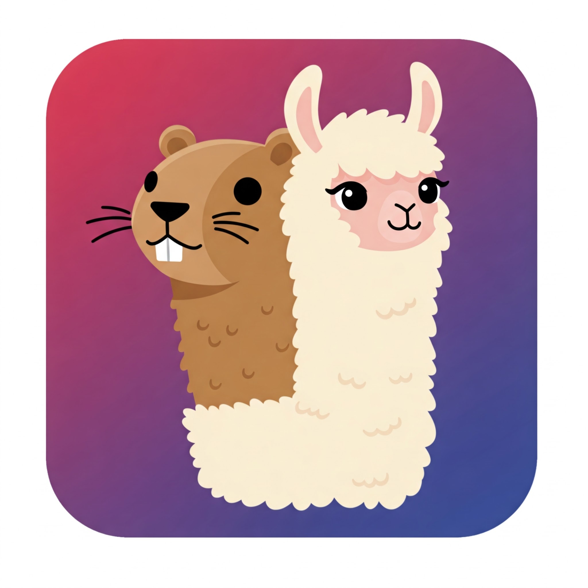
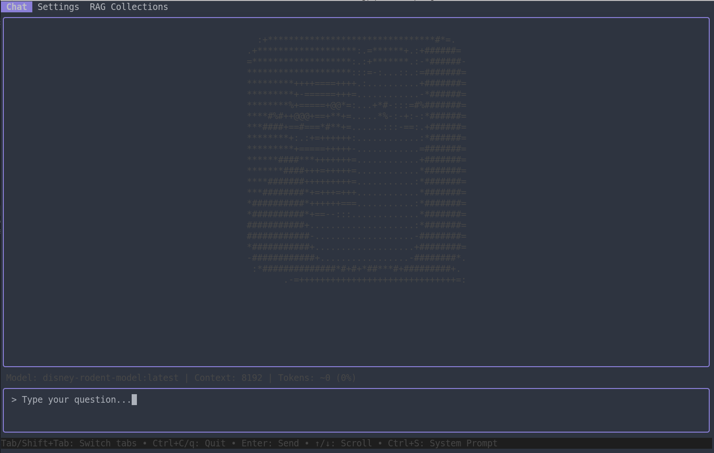

# gollama-chat

<div align="center">
  
</div>

A text user interface (TUI) for chatting with Large Language Models via Ollama.

<div align="center">
  
</div>


## Features

- **Clean TUI**: Built with [Bubble Tea](https://github.com/charmbracelet/bubbletea) for a responsive terminal interface
- **Tab-based Navigation**: Switch between Chat and Settings tabs
- **Ollama Integration**: Chat with any Ollama-supported model
- **Configurable**: Customize Ollama URL, model, temperature, and more
- **Message History**: In-memory chat history (cleared on exit)
- **Keyboard Navigation**: Fully keyboard-driven interface

## Installation

### Prerequisites

- Go 1.21 or later
- [Ollama](https://ollama.ai/) installed and running

### Building from Source

```bash
git clone https://github.com/kevensen/gollama-chat.git
cd gollama-chat
make build
```

## Usage

### Starting the Application

#### Terminal Mode (Default)
```bash
# Run directly
make run

# Or run the binary
./bin/gollama-chat
```

#### Web Mode (using GoTTY)
```bash
# Install GoTTY (one time setup)
go install github.com/sorenisanerd/gotty@latest

# Run with GoTTY web terminal
make gotty

# Or run manually
gotty -w ./bin/gollama-chat
```

Then open your browser to `http://localhost:8080` to access the TUI through a web terminal interface.

**Web Mode Features:**
- Access the full TUI interface through any modern web browser
- Powered by [GoTTY](https://github.com/sorenisanerd/gotty) for excellent terminal emulation
- Perfect Unicode support including beautiful rounded borders
- Useful for remote access or when running in containerized environments  
- All TUI features work identically in web mode

#### Docker Mode

##### Using Pre-built Images
```bash
# Use the latest pre-built image from GitHub Container Registry
docker run -p 8080:8080 -v gollama-config:/home/appuser/.config/gollama ghcr.io/kevensen/gollama-chat:latest

# Use docker compose with pre-built image
docker compose up

# Or see docker-compose.example.yml for a complete setup with Ollama
docker compose -f docker-compose.example.yml up
```

##### Building Locally
```bash
# Build and run with Docker
docker build -t gollama-chat .
docker run -p 8080:8080 -v gollama-config:/home/appuser/.config/gollama gollama-chat

# Or use docker compose to build locally
docker compose up --build
```

**Docker Features:**
- Multi-platform support (amd64, arm64)
- Alpine-based lightweight container  
- Built-in GoTTY web terminal on port 8080
- Persistent configuration via volume mounts
- Health checks included
- Non-root user for security
- Automated builds via GitHub Actions

### Command Line Options

```bash
gollama-chat [options]

Options:
  -h                Show help
  -child            Internal flag for PTY mode (used by GoTTY)
```

Examples:
```bash
# Run in terminal mode (default)
./gollama-chat

# Run with GoTTY for web access
gotty -w ./bin/gollama-chat
```

### Configuration

The application stores its configuration in:
- **Linux/macOS**: `~/.config/gollama/settings.json`
- **Windows**: `%APPDATA%\gollama\settings.json`

Default configuration:
```json
{
  "chatModel": "llama3.3:latest",
  "embeddingModel": "embeddinggemma:latest",
  "ragEnabled": true,
  "ollamaURL": "http://localhost:11434",
  "chromaDBURL": "http://localhost:8000",
  "chromaDBDistance": 1.0,
  "maxDocuments": 5,
  "selectedCollections": {},
  "defaultSystemPrompt": "You are a helpful Q&A bot. Your purpose is to provide direct, accurate answers to user questions. When providing lists of items (such as countries, capitals, features, etc.), format your response using proper numbered or bulleted lists. Be consistent in your formatting. If you don't know the answer, state that you are unable to provide a response."
}
```

### Keyboard Shortcuts

#### Global
- `Tab` / `Shift+Tab` - Switch between tabs
- `Ctrl+C` / `q` - Quit application

#### Chat Tab
- `Enter` - Send message
- `Ctrl+L` - Clear chat history
- `Ctrl+S` - Toggle system prompt display
- `↑` / `↓` - Scroll through messages
- `←` / `→` - Move cursor in input

#### Settings Tab
- `↑` / `↓` - Navigate between fields
- `Enter` - Edit selected field
- `S` - Save configuration
- `R` - Reset to defaults
- `Esc` - Cancel editing

## Configuration Options

| Setting | Description | Default |
|---------|-------------|---------|
| `chatModel` | Model to use for chat | `llama3.3:latest` |
| `embeddingModel` | Model to use for embeddings in RAG | `embeddinggemma:latest` |
| `ragEnabled` | Enable RAG (Retrieval Augmented Generation) | `true` |
| `ollamaURL` | URL of the Ollama server | `http://localhost:11434` |
| `chromaDBURL` | URL of the ChromaDB server | `http://localhost:8000` |
| `chromaDBDistance` | Distance threshold for similarity search | `1.0` |
| `maxDocuments` | Maximum documents to retrieve for RAG | `5` |
| `selectedCollections` | Selected collections for RAG queries | `{}` |
| `defaultSystemPrompt` | Default system prompt for conversations | (See configuration example) |

## Docker Usage

gollama-chat provides full Docker support with a multi-stage Alpine-based container that includes GoTTY for web terminal access.

### Quick Start with Docker

```bash
# Build the Docker image
docker build -t gollama-chat .

# Run with volume for persistent configuration
docker run -p 8080:8080 \
  -v gollama-config:/home/appuser/.config/gollama \
  gollama-chat

# Or use docker-compose (recommended)
docker-compose up --build
```

Access the application at `http://localhost:8080` in your web browser.

### Docker Compose (Recommended)

The included `docker-compose.yml` provides the simplest setup:

```yaml
services:
  gollama-chat:
    build: .
    ports:
      - "8080:8080"
    volumes:
      - gollama-config:/home/appuser/.config/gollama
    healthcheck:
      test: ["CMD", "wget", "--no-verbose", "--tries=1", "--spider", "http://localhost:8080/"]
      interval: 30s
      timeout: 10s
      retries: 3
      start_period: 5s

volumes:
  gollama-config:
```

Run with:
```bash
docker compose up --build
```

### Docker Configuration

The Docker container:
- Uses Alpine Linux for minimal size (~50MB)
- Runs as non-root user (`appuser`) for security
- Includes GoTTY for excellent web terminal emulation
- Supports full Unicode including rounded borders
- Provides persistent configuration via volume mounts
- Includes health checks for container orchestration

### Volume Mounts

The container stores configuration in `/home/appuser/.config/gollama`. Mount this directory to persist settings:

```bash
# Named volume (recommended)
docker run -v gollama-config:/home/appuser/.config/gollama gollama-chat

# Bind mount to host directory
docker run -v ~/.config/gollama:/home/appuser/.config/gollama gollama-chat
```

### Building Custom Images

```bash
# Build with custom tag
docker build -t my-gollama-chat:latest .

# Build with specific Go version
docker build --build-arg GO_VERSION=1.24.4 -t gollama-chat .

# Multi-platform build (requires buildx)
docker buildx build --platform linux/amd64,linux/arm64 -t gollama-chat .
```

### Docker Environment

The container provides:
- **Port 8080**: GoTTY web terminal interface
- **Working Directory**: `/app`
- **User**: `appuser` (non-root, UID 1000)
- **Config Path**: `/home/appuser/.config/gollama`
- **Health Check**: HTTP endpoint on port 8080

### Troubleshooting Docker

**Container won't start:**
```bash
# Check logs
docker logs <container-id>

# Run with debug output
docker run -it gollama-chat sh
```

**Configuration not persisting:**
```bash
# Verify volume mount
docker inspect <container-id> | grep -A 10 Mounts

# Check volume contents
docker run --rm -v gollama-config:/data alpine ls -la /data
```

**Web interface not accessible:**
```bash
# Check port mapping
docker ps

# Test health check manually
docker exec <container-id> wget -qO- http://localhost:8080
```

## Project Structure

```
gollama-chat/
├── cmd/
│   └── main.go                 # Application entry point
├── internal/
│   ├── configuration/          # Configuration management
│   │   ├── configuration.go
│   │   └── models/
│   │       └── models.go
│   ├── rag/                    # RAG (Retrieval Augmented Generation)
│   │   ├── service.go
│   │   └── service_test.go
│   └── tui/                    # Text User Interface
│       ├── ascii/
│       │   └── ascii.go
│       ├── core/
│       │   ├── tui.go         # Main TUI controller
│       │   ├── tui_test.go
│       │   └── height_31_test.go
│       ├── tabs/              # Tab implementations
│       │   ├── chat/
│       │   │   ├── chat.go    # Chat functionality
│       │   │   ├── chat_test.go
│       │   │   ├── messages.go
│       │   │   ├── message_cache.go
│       │   │   ├── model_context.go
│       │   │   ├── styles.go
│       │   │   ├── system_prompt.go
│       │   │   ├── token_counts.go
│       │   │   └── input/
│       │   │       ├── input.go
│       │   │       ├── input_test.go
│       │   │       └── PERFORMANCE_TESTING.md
│       │   ├── configuration/
│       │   │   ├── configuration.go # Settings tab
│       │   │   ├── models/
│       │   │   └── utils/
│       │   │       └── connection/
│       │   └── rag/
│       │       ├── rag.go
│       │       ├── collections_service.go
│       │       └── README.md
│       └── util/
│           ├── util.go
│           └── util_test.go
├── images/                    # Application images
│   ├── Icon.png
│   └── Screenshot.png
├── bin/                       # Built binaries
├── Makefile                   # Build automation
├── go.mod                     # Go module definition
├── TESTING.md                 # Testing documentation
├── TEST_COVERAGE_STRATEGY.md  # Coverage strategy
└── README.md                  # This file
```

## Development

### Building

```bash
make build
```

### Running

```bash
make run
```

### Development Workflow

```bash
make dev  # Runs fmt, vet, test, and build
```

### Docker Development

```bash
# Build and test Docker image
make docker-build
docker run -p 8080:8080 gollama-chat

# Development with volume mount for live config changes
docker run -p 8080:8080 \
  -v $(pwd)/config:/home/appuser/.config/gollama \
  gollama-chat

# Clean up Docker resources
docker system prune -f
```

### Docker Registry & Multi-Platform Builds

The project includes GitHub Actions workflows for automated multi-platform Docker builds to GitHub Container Registry. See [DOCKER-REGISTRY-SETUP.md](DOCKER-REGISTRY-SETUP.md) for detailed information on:

- Understanding the automated build process
- Using pre-built multi-platform images
- Image tagging strategy
- Troubleshooting builds

**Quick start with pre-built images:**
```bash
# Use GitHub Container Registry (no setup required)
docker run -p 8080:8080 ghcr.io/kevensen/gollama-chat:latest

# Available platforms: linux/amd64, linux/arm64
```

### Local GoTTY Development

For testing web terminal functionality without Docker:

```bash
# Install GoTTY if not already installed
go install github.com/sorenisanerd/gotty@latest

# Run with GoTTY
make gotty

# Or manually with custom options
gotty -w --title-format "gollama-chat" ./bin/gollama-chat
```

### Testing

```bash
# Run all tests
make test

# Run tests with coverage report
make test-coverage

# Run performance regression tests
make test-performance

# Run input component benchmarks
make test-input-bench
```

#### Performance Testing

The project includes comprehensive performance testing to prevent input latency regressions:

- **Input Performance**: Benchmarks for typing responsiveness and character insertion
- **Regression Prevention**: Automated performance threshold monitoring
- **Memory Profiling**: Allocation pattern analysis and optimization
- **Real-world Scenarios**: Complex editing and Unicode handling tests

See [`internal/tui/tabs/chat/input/PERFORMANCE_TESTING.md`](internal/tui/tabs/chat/input/PERFORMANCE_TESTING.md) for detailed performance testing documentation.

## Architecture

The application follows principles of high cohesion and loose coupling:

- **Configuration**: Centralized configuration management with JSON persistence
- **TUI Controller**: Main application state and tab management
- **Composable Views**: Each tab is a separate, reusable component
- **Message Passing**: Uses Bubble Tea's message-based architecture

## Requirements

- Ollama server running locally or accessible via network
- Terminal with color support
- Go 1.21+ for building from source

## License

This project is licensed under the MIT License - see the [LICENSE](LICENSE) file for details.

## Contributing

1. Fork the repository
2. Create a feature branch
3. Make your changes
4. Run `make dev` to ensure code quality
5. Submit a pull request

## Roadmap

- [ ] Message persistence options
- [ ] Multiple conversation support
- [ ] Model switching during chat
- [ ] Export conversations
- [ ] Streaming responses
- [ ] MCP Integration
